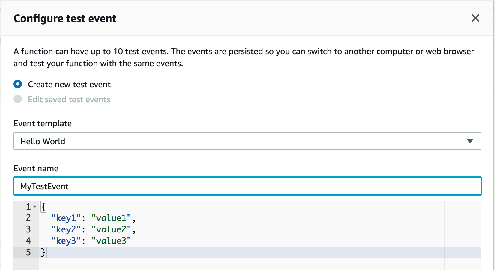
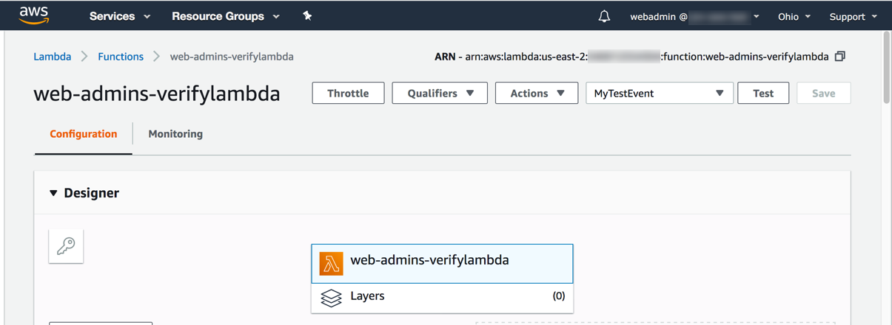
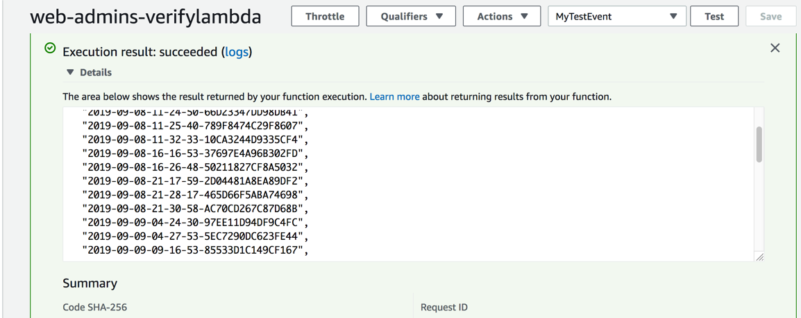

# Permission Boundaries Round <small>VERIFY phase</small>

You are now in the **VERIFY** phase. It is time to put on the hat of the web admins and test out their access. 

You should have received from another team the following information:

* IAM users sign-in link: **https://*`<Account_ID>`*.signin.aws.amazon.com/console**
* IAM User Name:	**webadmin**
* IAM User Password:
* Resource Restriction Identifier: (i.e. **web-admins-**)
* Permissions Boundary Name: **webadminpermissionboundary**
* Permission Policy Name: **webadminpermissionpolicy**

You will be setting up an IAM policy, an IAM role and a Lambda function. The Lambda function should be able to list files in an S3 bucket. This is how you will verify you are able to do what the web admins are allowed to do.

The web admins should not be able to impact any resources in the account that they do not own (e.g. the Application admins) including IAM users, IAM roles, S3 buckets, Lambda functions, etc.

Application architecture: 

## Task 1 <small>Create a Customer Managed IAM Policy</small>
	
The first step is to create an IAM policy. This will set the permissions of the role that you will pass to a Lambda function. Since the function will be working with S3 and since the point of this is to show how permission boundaries work, use the following policy which grants basic Lambda logging permissions and S3 full access. 

Keep in mind the resource restrictions put in place which will require you to use a certain prefix in the name (the **Resource Restriction Identifier**) of the IAM policy.

### Walk Through

1. Browse to the [IAM console](https://console.aws.amazon.com/iam/home).
2. Click **Policies** on the left menu, create a new IAM policy that will act as the permissions policy for the IAM role that will be attached to the Lambda function by clicking **Create policy**.
3. Switch to the **JSON** tab, **copy** the IAM policy from below and click **Review policy**:

	``` json
	{
	    "Version": "2012-10-17",
	    "Statement": [
	        {
	            "Effect": "Allow",
	            "Action": [
	                "logs:CreateLogGroup",
	                "logs:CreateLogStream",
	                "logs:PutLogEvents",
	                "s3:*"
	            ],
	            "Resource": "*"
	        }
	    ]
	}
	```

4. Name the IAM policy by entering a name into the **Name** field based on the resource restrictions (the **Resource Restriction Identifier**) put in place for the IAM policy name.
5. Enter an optional description into the **Description** field and click **Create policy** to create the IAM policy.

## Task 2 <small>Create an IAM Role for Lambda</small>

Next create an IAM Role and choose Lambda as the service for this role. Attach the IAM policy you just created and the permission boundary (which should be named: **webadminpermissionboundary**).

Keep in mind the resource restrictions put in place which will require you to use a certain prefix in the name (the **Resource Restriction Identifier**) for the IAM role.

### Walk Through

1. Browse to the [IAM console](https://console.aws.amazon.com/iam/home).
2. Click **Roles** on the left menu and create a new IAM role:
	1. Select **AWS service** as the type of trusted entity.
	2. Choose **Lambda** as the service for this role and click **Next: Permissions**.
	3. *Attach* the newly created IAM policy above to the role under **Permission Policies**.
	4. *Attach* the **`webadminpermissionboundary`** IAM permission boundary policy to the role under **Permission Boundary Policy** (or the name listed for **Permissions Boundary Name** on the information you were given by the other team).
	5. Click **Next: Tags**.
	6. Click **Next: Review**.
	7. Name the IAM role by entering a name into the **Role name** field based on the resource restrictions (the **Resource Restriction Identifier**) put in place for the IAM role name.
	8. Enter an optional description into the **Description** field and click **Create role** to create the IAM role.

## Task 3 <small>Create a Lambda function</small>

Finally you will create a **Node.js 8.10** Lambda function using the code below and attach the IAM role you just created to it. You will need to replace `"<WEB_ADMIN_BUCKET_NAME>"` with the S3 bucket name from the account that begins with `"web-admins-"` and ends in `"-data"`.

Keep in mind the resource restrictions put in place which will require you to use a certain prefix in the name (see the **Resource Restriction Identifier**) for the Lambda function.

### Walk Through
#### Create a Lambda function

1. Browse to the [Lambda console](https://console.aws.amazon.com/lambda/home?region=us-east-2region#/functions).
2. Click **Functions** on the left menu and click **Create function** to create a new Lambda function:

	i. Choose **Author from scratch**.
	
	ii. Name the Lambda function based on the resource restrictions (the **Resource Restriction Identifier**) put in place for the Lambda function name.
	
	iii. Select **Node.js 8.10** as the **Runtime**.
	
	iv. Select **Use an existing role** under **Execution role**.
	
	v. Select your newly created Lambda IAM role above under **Existing role**.
	
	vi. Click **Create function** to complete creating the Lambda function.

3. Copy the following code into the **index.js** file under the **Function code** section of the newly created Lambda function:

	**Remember** to replace the `'<WEB_ADMIN_BUCKET_NAME>'` snippet of code with the S3 bucket name from the account that begins with `web-admins-` and ends in `-data`.
	
	``` node
	const AWS = require('aws-sdk');
	const s3 = new AWS.S3();
	
	exports.handler = async (event) => {
	  console.log('Loading function');
	  const allKeys = [];
	  await getKeys({ Bucket: '<WEB_ADMIN_BUCKET_NAME>' }, allKeys);
	  return allKeys;
	};
	
	async function getKeys(params, keys){
	  const response = await s3.listObjectsV2(params).promise();
	  response.Contents.forEach(obj => keys.push(obj.Key));
	
	  if (response.IsTruncated) {
	    const newParams = Object.assign({}, params);
	    newParams.ContinuationToken = response.NextContinuationToken;
	    await getKeys(newParams, keys); 
	  }
	}
	```

4. Click **Save** at the top right of the Lambda function to save your code changes.

#### Test the Lambda function

Test the Lambda function, make sure it is generating logs in CloudWatch Logs and that it is able to list the objects in the S3 bucket that begins with `web-admins-` and ends in `-data`.

1. Browse to the [Lambda console](https://console.aws.amazon.com/lambda/home?region=us-east-2region#/functions).
2. Click **Functions** on the left menu and click on your newly created Lambda function.
3. Click **Test** at the top of the Lambda console.
	
4. Enter **`MyTestEvent`** as the **Event name** in the **Configure test event** dialog box and click **Create**.
	
5. With your newly created **`MyTestEvent`** Lambda test event selected, click **Test** to execute the Lambda function.
	
6. You should see an **Execution result: succeeded** message after a few seconds that demonstrates your Lambda function worked correctly. If you click **Details** to expand the results, you will get a list of all the S3 objects in the S3 bucket that begins with `web-admins-` and ends in `-data`.
	
	If you see this then **Congratulations** you have finished the verification task!
	
7. If not and you see an **Execution result: failed** message, then you will need to troubleshoot further. Start by clicking **Details** to review the Lambda execution results.

## Task 4 <small>Investigate if you are able to do anything else</small>

The final step is to determine if you can do anything else in the account. Can you impact any resources not owned by the web admins?

### <small>[Click here to go to the CLEANUP phase](./cleanup.md)</small>
